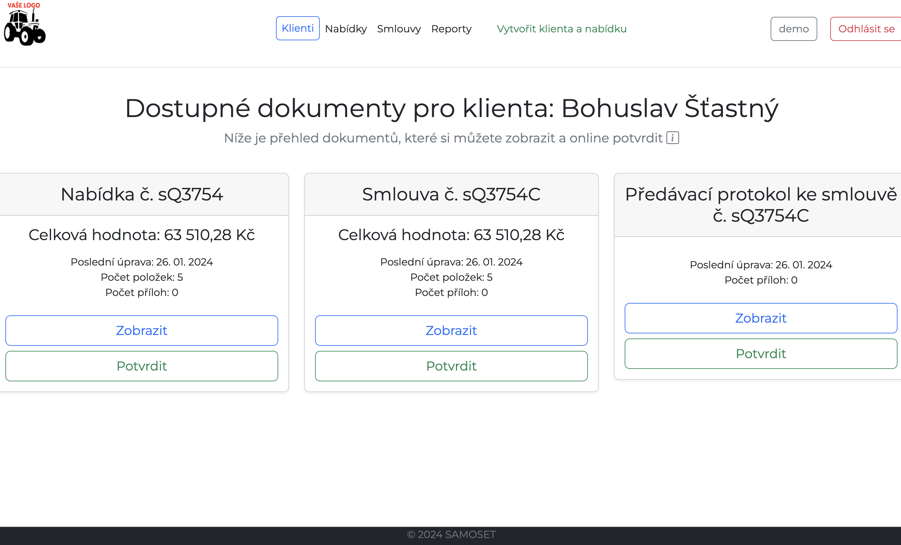

# kontraktor - Document Management App

kontraktor is a web application built with Django and Docker that helps manage documents and contracts. 

## Features

- Client and proposal management - Add, edit, and track clients and their associated proposals

- Contract generation - Create custom contracts in PDF format to send to clients

- E-signing - Clients can electronically sign documents right in the browser

- Proposal parsing - Upload a client's proposal and automatically extract key details into your own proposal format

- Attachments - Add supplementary files like images, PDFs, spreadsheets to proposals and contracts

## Demo

Try out a live demo at: [https://demo.samoset.cz](https://demo.samoset.cz) 

## Getting Started

To run kontraktor locally:

1. Clone the repo
2. Configure the Docker environment  
3. Run migrations and create admin user
4. Start the dev server

## Screenshots

*Client page view*

## About 

Kontraktor was created to simplify contract and document management.

Learn more about business logic at: [www.samoset.cz](www.samoset.cz).

## License

This project is licensed under the MIT License.
